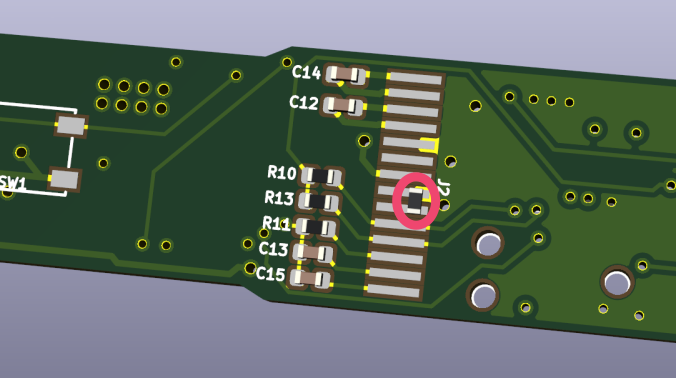
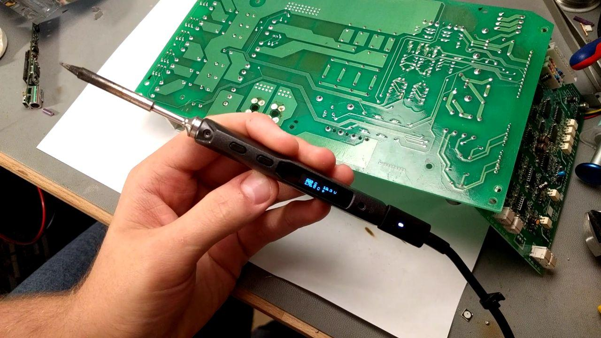

# Otter-Iron

Replacement PCB for TS100, adds USB-C PD to every hackers favourite tool!

Hardware is finished and working, software V0.3 is released!

Features:
 - You can solder!
 - Tmperature can be adjusted via buttons
 - USB-PD requests highest voltage
 - Display shows set-temperature, temperature, input-voltage and power applied
 - Saves last set-temperature
 - Designed by an Otter *chirps* :3

## Ordering and assmebly instructions

The BOM can be found at [KiCAD/production/kitspace_bom.csv](KiCAD/production/kitspace_bom.csv). Most parts are generic parts, which can be ordered and assembled regulary. However the display and tip-holders need special attention. The PCB has to be ordered with a thickness of 1mm (1.6mm works too, but 1mm has a better fit).

### Known hardware issues/notes

 * **Note: C19 and C20 changed from 100nF to 1µF in the last revision, please make sure to populate 1µF!**
 * Please add a pullup to the displays reset if the display does not work. See image below:
 
 

### Tip-Holders / mechanical parts

The original tip-holders are custom made thus it is not possible to buy them, if you already have a TS100 it is highly recommended to recycle those. They can be unscrewed, cut to size and soldered/screwed onto the Otter-Iron. This is the preferred option!

If you don't own a TS100 you can buy one from miniware (price ranges from 35$ to 45$) and harvest the parts (as well as the casing and tip!).

You can also buy the littlefuse fuseholders mentioned in the BOM. Those however have a very bad fit, you have to bend them and add a little solder notch, otherwise you may destroy your tips. In addition to this solution you also need to buy a spare case+tip which is ~25-35$, this is the least preferred option.

### Display

The display can be bought from [LCSC](https://lcsc.com/product-detail/OLED-Displays-Modules_UG-Univision-Semicon-UG-9616TSWCG02_C88335.html) or [Aliexpress](https://de.aliexpress.com/item/32808645444.html), I haven't found it at Mouser yet ([Maybe its this display?](https://www.mouser.de/ProductDetail/ELECTRONIC-ASSEMBLY/EA-W096016-XALW?qs=f9yNj16SXrJLTMk24BHqcA%3D%3D)). It is the last part to be assembled, it is soldered on the back of the pcb facing the PCB and the tip-end. 

## Flashing

To flash the Otter-Iron short the DFU-jumper shown in the image below while plugging it into your computer. This will put the iron into DFU mode allowing you to flash it via DFU/USB. 

If you already have ad firmware >= v0.2 flashed you can press both buttons while plugging in to enter DFU mode.

Run this command to flash the downloaded binary.

    $ dfu-util -a 0 -s 0x08000000:leave -D firmware.bin

## Video

## Images

## Todo software

 - [x] Write a better regulation
 - [ ] Current measurement
 - [x] Store last setpoint
 - [ ] Better Fonts/UI
 - [ ] PD-Profile cycling
 
## Todo Hardware

Todo next hardware revision:
 - [ ] Add barrel jack
 - [ ] Add grounding solution
 - [x] Fix Tag-Connect [see #4](https://github.com/Jan--Henrik/Otter-Iron/issues/4)
 - [x] Optimize display-connector
 - [x] Add display reset pullup
